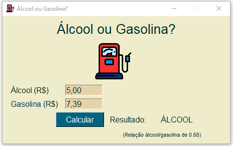

# Álcool ou Gasolina

Um programa simples que informa se é melhor abastecer com álcool ou gasolina.    
    
Digite os valores em reais do álcool e da gasolina e descubra qual está valendo mais a pena escolher para abastecer seu carro.
O programa possui GUI (interface) utilizando a biblioteca PySimpleGui. Imagem de demonstração do programa. Você pode baixar na [seção de releases](https://github.com/Danfluz/alcoolougasolina/releases).

